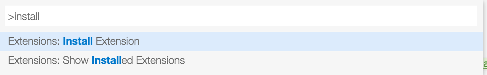

# VS Code JavaScript Standard Format

This extension adds [Standard format](https://github.com/maxogden/standard-format) function to JavaScript.

Please only use it when you are ok with [JavaScript Standard Style](http://standardjs.com/).

## Installation

1. Press `F1` to bring up Command Palette
2. Search for `Extensions: Install Extension` and select the command, VS Code would load all available extensions
    
3. Input `JavaScript Standard Format`, VS Code will filter the extension out, click and install it
    

## Usage

1. Press `F1` to bring up Command Palette
2. Search for `Format Code` and click it
3. Done

## License

MIT